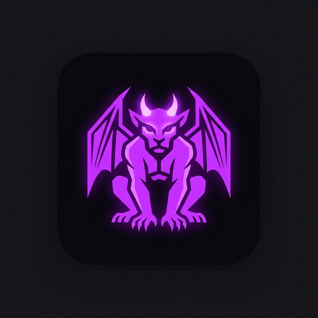

# DeLasGargolasChat v1.1

Plataforma de chat en tiempo real desarrollada con **Django** y **WebSockets**. Este proyecto permite comunicación instantánea, envío de archivos, notas de voz y videollamadas mediante WebRTC.

## ✨ Características Principaless

- **Tiempo Real**: Mensajería rápida basada en Django Channels y ASGI.
- **Multimedia**:
  - 📎 Envío de archivos y previsualización de imágenes.
  - 🎤 Grabación y envío de notas de voz.
- **WebRTC**: Videollamadas y llamadas de voz directas ("Cara a Cara").
- **Seguridad**: Autenticación integrada, protección contra XSS y CSRF.
- **Portable**: Generación de ejecutable (.exe) para Windows sin dependencias.

## 🛠 Requisitos Técnicos

- **Backend**: Python 3.10+, Django 6.x, Channels.
- **Servidor ASGI**: Daphne.
- **Base de Datos**: SQLite (Local) / PostgreSQL (Recomendado para producción).

## 🚀 Despliegue Recomendado

Este proyecto **NO** es compatible con InfinityFree (PHP). Se recomienda usar:
- **Render.com** (Web Service + Redis Instance).
- **Railway.app**.

## 💻 Ejecución Local

1. Clona el repositorio.
2. Crea un entorno virtual: `python -m venv venv`.
3. Instala dependencias: `pip install -r requirements.txt`.
4. Ejecuta: `python manage.py migrate`.
5. Inicia el servidor: `daphne -p 8000 DeLasGargolasChat.asgi:application`.
