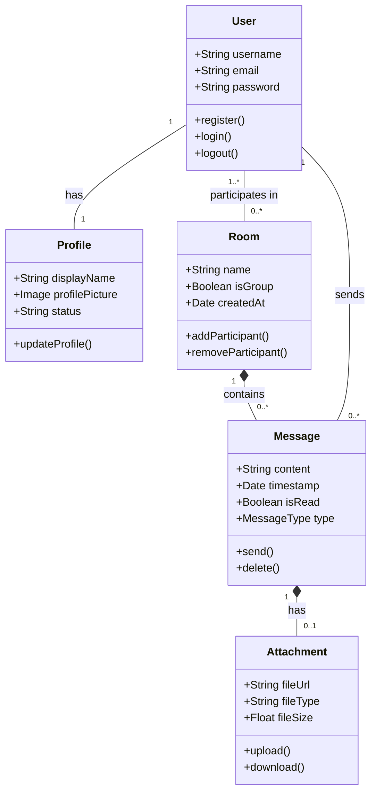

# 2. Análisis del Problema: Modelo de Dominio

El modelo de dominio define la estructura conceptual de la aplicación DeLasGargolasChat y las relaciones entre entidades.

## Entidades Principales:
1. **User (Usuario):** Participante que usa el sistema.
2. **Profile (Perfil):** Configuración visual e información adicional del usuario (foto).
3. **Room / Chat (Sala):** Representa un hilo de conversación. Puede ser `Directo` (entre dos usuarios) o `Grupal` (entre varios).
4. **Message (Mensaje):** La unidad básica de comunicación. Puede ser de texto, archivo adjunto o mensaje de voz.
5. **Attachment (Adjunto):** Entidad que representa el archivo físico subido en un mensaje.

---

## Diagrama de Clases Conceptuales (Modelo de Dominio)

