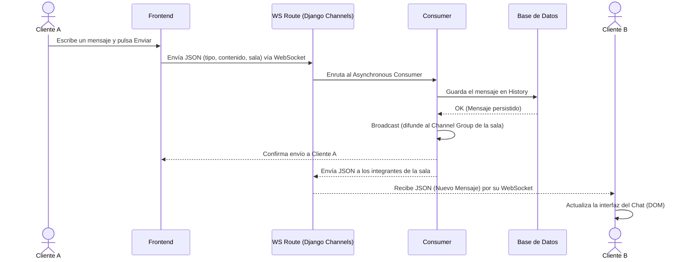

# 3. Diagramas de Secuencia del Sistema DeLasGargolasChat

Este diagrama de secuencia ilustra de forma general la interacción del Emisor (Cliente A), el Sistema Base (Django Server & WebSocket) y el Receptor (Cliente B) durante el envío de un mensaje de texto.

## Secuencia: Enviar Mensaje (Chat en Tiempo Real)

