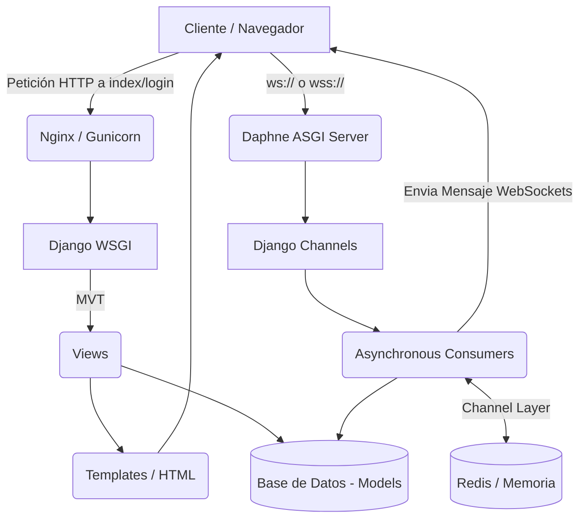

# 4. Arquitectura y Protocolos

## 4.1 Patrón de Diseño en Django (MVT) y WebSockets (ASGI)

Django clásico utiliza el patrón **MVT (Model-View-Template)**, en el que se reciben peticiones HTTP estándar. Sin embargo, para **DeLasGargolasChat** la comunicación es en **Tiempo Real**, por lo tanto, la arquitectura de Django tradicional se expande a **ASGI (Asynchronous Server Gateway Interface)** usando **Django Channels**.

### Esquema del Sistema Híbrido MVT + ASGI



**Explicación:**
- **MVT:** Para cosas estáticas como registrarse, el `Template` manda la orden a la `View`, y esta pide datos al `Model`.
- **Channels MVT-Híbrido:** Una vez autenticados, el cliente abre una conexión TCP bidireccional mediante `Daphne`. Los `Consumers` (el análogo a la vista, pero asíncrono) gestionan esta conexión y retransmiten mensajes a través de Redis (`Channel Layer`).

---

## 4.2 Explicación del Funcionamiento del Protocolo WebSocket

A diferencia del protocolo HTTP tradicional (donde el cliente pregunta y el servidor responde una vez por conexión), el **WebSocket** establece una única conexión **persistente** y bidireccional. 

### Esquema de WebSocket en DeLasGargolasChat

```text
Cliente A (Navegador)                               Servidor Django (Daphne)
     |                                                       |
     | ---- Petición HTTP GET /chat/room con cabecera UPGRADE -->|
     | <--- HTTP 101 Switching Protocols (Se acepta conexión) ---|
     |                                                       |
     | =================> CONEXIÓN ESTABLECIDA <============ |
     |                                                       |
     | --- Frame WS: {type: 'chat', text: 'Hola a todos'} ---->  |
     |                                                       | (Procesa y guarda en BD)
     | <------- Frame WS: {text: 'A envió: Hola...'} ----------  |
     |                                                       | (El Servidor empuja a otros clientes conectados)
```

1. **La petición inicial (Handshake):** El cliente usa HTTP estándar pero pide un "Upgrade" a WebSocket.
2. **Conexión Abierta:** El servidor acepta la conexión (`Status 101 Switching Protocols`). Desde este momento, ambas partes pueden mandar datos o mensajes (Frames) libremente, en cualquier momento, eludiendo la latencia HTTP repetida.
3. **Paso de mensajes:** Para el chat de grupo o individual, Django Channels usa un "Channel Layer" para recibir el mensaje de A, pasarlo por todas las tuberías vinculadas a esa Sala (Group), y enviarlo así a los respectivos clientes asíncronamente.
